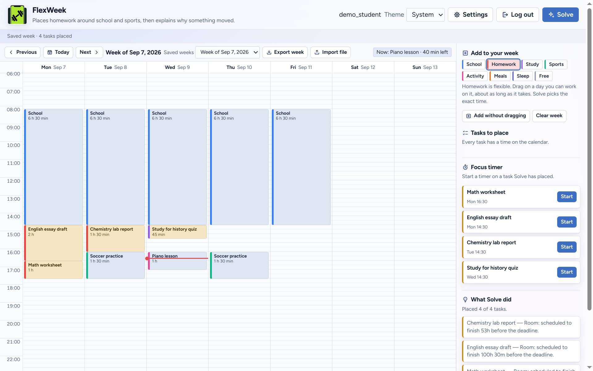
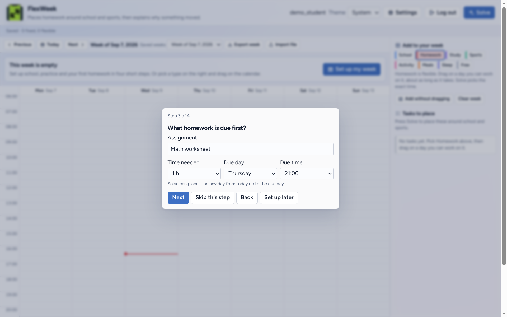
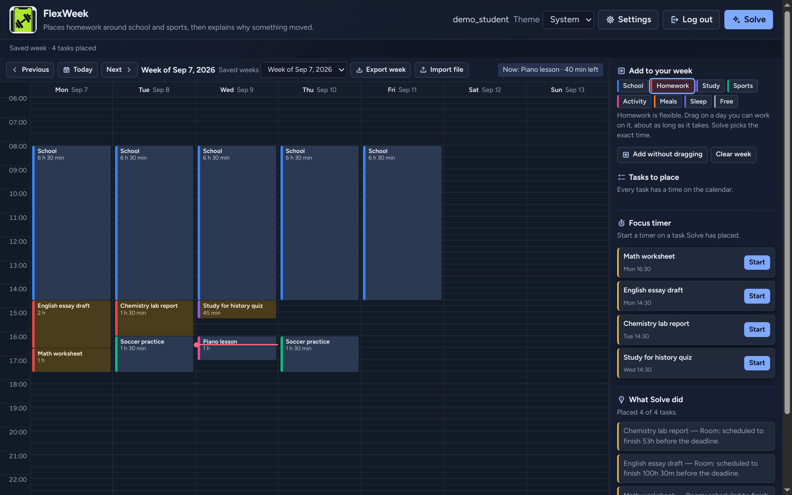

# FlexWeek

Places homework around school and sports, then explains why something moved.

Congressional App Challenge 2026. No chatbot. No product demo mode.



## Download

From the [latest GitHub Release](https://github.com/j0nsh1n/FlexWeek/releases/latest):

- **Download for Windows.** `FlexWeek-Windows-x64-Setup.exe`
- **Download for Linux.** `FlexWeek-Linux-x86_64.tar.gz`

Checksum files (`.sha256`) sit next to those downloads if you want to confirm the file is complete. You can ignore them and still open FlexWeek.

**Windows.** Run `FlexWeek-Windows-x64-Setup.exe`. It installs FlexWeek for your Windows account without an administrator, then open FlexWeek from the Start menu. If Windows shows "Windows protected your PC", choose More info, then Run anyway. FlexWeek is not code-signed yet; the warning is SmartScreen not recognizing a new publisher, not a virus finding. Schools and IT can deploy `FlexWeek-Windows-x64.msi` instead, which installs for every account on the PC. Uninstall from Settings, then Apps.

**Linux.** Extract the archive and open the file named FlexWeek. You need a 64-bit Linux desktop (GNOME, KDE Plasma, Cinnamon, Xfce), glibc 2.38 or newer (Ubuntu 24.04, Linux Mint 22, Debian 13, Fedora 39 or newer), and working graphics (OpenGL or EGL). A remote or headless session without a display will not work. The X11 cursor helper (libxcb-cursor) is inside the download.

**Linux AppImage.** If `FlexWeek-x86_64.AppImage` won't start (missing FUSE), run `chmod +x FlexWeek-x86_64.AppImage && ./FlexWeek-x86_64.AppImage --appimage-extract`, which unpacks a `squashfs-root` folder, then run `./squashfs-root/AppRun`. Without FUSE, the tarball above is the reliable choice.

**Chromebooks.** Not supported. FlexWeek is a Windows and Linux desktop app; there is no web version.

Open FlexWeek. The first screen is Sign in; choose "New here? Create an account" under it, then follow setup a page at a time: a style, your week, how homework gets a time, reminders and the alarm sound, and your first homework. You can skip any page.

## Screenshots

| First-week setup | Dark theme |
| --- | --- |
|  |  |

## Run from source

Requires Python 3.14.

```bash
python -m venv .venv
source .venv/bin/activate   # Windows: .venv\Scripts\activate
pip install -r requirements.txt
pip install -r requirements-desktop.txt
python -m desktop.main
```

The backend starts inside the app on a loopback port; there is no separate
server to run and no page to open in a browser. The first screen is Sign in,
with "New here? Create an account" under it. Usernames use 3–32 letters,
numbers or underscores; passwords use 12–128 characters. A new account opens
setup a page at a time: a style, the week (school, activities and a cutoff),
how homework gets a time, reminders and the alarm sound, and up to three first
homework. You can skip any page, and Settings can run it again.

To add more, open **More** and choose **Add homework** or **Add fixed time**, or
drag on the calendar. A **Fixed time** (school, practice) never moves when you
plan; **Homework** is placed by Plan my homework in a free time before it is due.
The type you picked determines which you get. Every change saves to your account
on its own; planning previews placement without replacing what you entered.

The look starts on System, which follows your device's light or dark setting.
The gear opens Settings, where look and layout live together, and every design
can be dark: Today's app through its pack, the others through a dark colourway
of their own. The week saves itself a moment after each change and retries on
its own if a save fails. A save that conflicts with another window is never written over: saving
stops and FlexWeek asks you to reload the saved week. A forgotten password is recovered
with one of the eight recovery codes shown when the account was made.

Weeks exported from an older browser-based build can be explicitly imported
after logging in. Import replaces the account's current week after confirmation;
invalid legacy data is left untouched.

## Data and configuration

FlexWeek keeps its database in your user data folder (on Linux,
`~/.local/share/FlexWeek/flexweek.db`) and starts its own backend on a private
loopback port. Nothing needs configuring to use it.

| Setting | Effect |
|---|---|
| `--database FILE` | Use this database file instead of the one in your data folder |
| `FLEXWEEK_DESKTOP_ORIGIN` (or `FLEXWEEK_ORIGIN`) | Use a FlexWeek API running elsewhere instead of starting one; an invalid value is an error, never a quiet fall back to local |

The API can also run on its own, for development or as a server other copies
point at: `uvicorn backend.app:app` reads `FLEXWEEK_DATABASE` (default
`var/flexweek.db`) and `FLEXWEEK_ORIGIN` (default `http://127.0.0.1:8000`) and
serves the API only, no pages. Non-local origins require HTTPS, and HTTPS uses
Secure session cookies. A hosted API needs a persistent database directory and
backups, and trusted reverse proxies configured explicitly so client-address
throttling sees the real source.

The database and its journals are gitignored. Back up the database with SQLite's
backup API or with the app stopped; protect backups as private account data.

## Checks

```bash
.venv/bin/python scripts/verify.py
```

This runs the backend and desktop source checks. Where PySide6 is absent, use
`--backend-only`; desktop is then explicitly unverified. See the
[coverage map and feature verification guide](docs/verification.md) for focused
checks and release limitations.

## Progress

Phases 3 and 4 are complete: accounts, saved weeks and Daily Scheduler themes
are verified in the native desktop app. See the [roadmap](roadmap.md) for
the separate desktop app, calendar interaction port, later design work and
contest delivery. Windows/Linux are desktop targets. Windows packages are
built on GitHub Actions when a release is published; a Windows machine still
needs a person to run the installer and click through SmartScreen.

A Linux desktop build exists: a native Qt window with the FastAPI backend
bundled inside it. It needs no separate server, no Python install and no
Chromium. Build it with `pip install -r requirements-desktop.txt` then
`./desktop/build_linux.sh`. Package the download with
`./desktop/package_linux.sh` to get `FlexWeek-Linux-x86_64.tar.gz` (and a
`.sha256`) containing README, icon, `.desktop` file and the app. Releases
attach that archive rather than committing `dist/`; see [DESKTOP.md](DESKTOP.md).
The paste-ready GitHub release text is in [docs/github-release.md](docs/github-release.md).
Set `FLEXWEEK_DESKTOP_ORIGIN` to point the window at a hosted deployment instead;
local and hosted accounts are separate, without automatic synchronization.

Windows packages are built on GitHub Actions when a release is published
(`desktop/build_windows.ps1`, then `packaging/windows/`) and attached as the
installers `FlexWeek-Windows-x64-Setup.exe` (Inno Setup, per account) and
`FlexWeek-Windows-x64.msi` (WiX, every account).
ICU (`icuuc`/`icuin`) is part of Windows 10 1809+; the bundle check requires
those imports to be satisfied without copying Microsoft's DLLs. The saved
theme names `nocturne` and `slate` come from Daily Scheduler (the GPL-3.0
`Local-Schedule-Assistant` project); the hybrid frost colors replaced its
palette in September 2026. AI assistance was used in development,
including Codex and GLM-5.3 Flash test contribution; the runtime uses no AI
service.

The original Sep 6 contest brief (working title Reslot) is in
[docs/cac-build-plan.md](docs/cac-build-plan.md). The living schedule is the
[roadmap](roadmap.md).

Submit by Sunday, October 25, 2026, 8:00 p.m. PDT.

License: GPL-3.0. Contributor listing is pending completion before submission.
